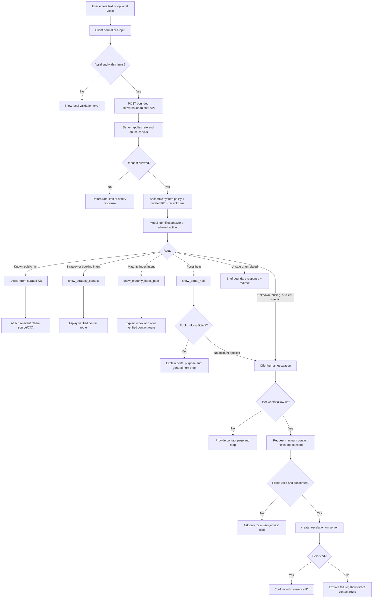

# Conversation Decision Tree

The agent should behave as a constrained support concierge, not a general
autonomous agent. The model handles natural language; deterministic code owns
validation, side effects, and data access.

## Routing rules

1. Answer directly only when the curated knowledge base supports the claim.
2. Do not infer service pricing, client account status, contractual terms,
   compliance certifications, or a portal URL.
3. For data security questions, describe Cadre's published approach. Do not
   promise a specific architecture or certification for a hypothetical client.
4. Treat contact information as optional until the user explicitly requests
   human follow-up.
5. Require consent before persisting an escalation.
6. Voice is an input/output adapter around the same text flow. It never creates
   a second agent path.

## Why not a large intent router?

The MVP has four meaningful outcomes: answer, show a verified CTA, collect an
escalation, or decline safely. A large classifier or multi-agent graph would add
latency and failure modes without improving those outcomes. Structured tools and
explicit policies provide enough control while keeping the code explainable.
