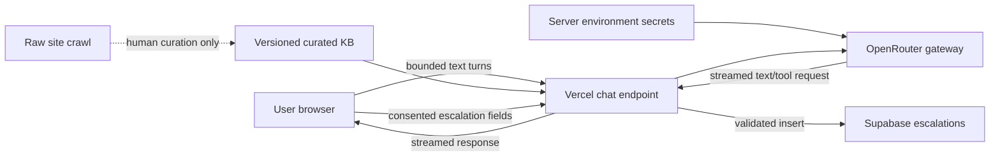

# Data and Storage Plan

## Data location by category

| Data | Location | Lifetime | Contains PII? | Notes |
|---|---|---:|---:|---|
| Raw public-site snapshots | Git repository or research artifact | Until refreshed | No expected PII beyond public business contacts | Audit source; never sent wholesale to model |
| Curated support knowledge | Git repository | Versioned | No | Loaded server-side into prompt/context |
| Conversation turns | Browser memory or `sessionStorage` | Current tab/session | Possibly | Do not persist by default |
| Server request payload | Vercel function memory | Request only | Possibly | Do not log transcript bodies |
| Escalation lead | Supabase, if approved | Retention period TBD | Yes | Minimal fields, consent required |
| API keys | Vercel environment variables | Until rotated | Secret | Never client-visible or committed |
| Operational metrics | Provider/Vercel metadata | Provider-defined | Avoid message content | Count, latency, status, estimated tokens |
| Voice audio | Browser speech implementation | Browser/vendor-defined | Potentially sensitive | App server should not receive audio in browser-native approach |

## Recommended MVP storage model

### Static knowledge

Keep the curated knowledge base in the application repository. It is small,
public, reviewable, and changes with code. This gives the evaluator a direct
view of what the model knows and why.

### Conversation

Keep the transcript client-side for the current session and send only a bounded
window to the chat endpoint. Do not create user accounts or persistent chat
history. This reduces privacy risk and removes a data model that the brief does
not require.

### Escalations

If real persistence is included, use one server-only table:

```sql
create table escalations (
  id uuid primary key default gen_random_uuid(),
  created_at timestamptz not null default now(),
  name text not null,
  email text not null,
  company text,
  question text not null,
  consented_at timestamptz not null,
  status text not null default 'new'
);
```

Constraints for implementation:

- Browser never receives a Supabase service-role key.
- Inserts occur only through a validated server endpoint/tool.
- No public read policy exists.
- Normalize email and enforce conservative field-length limits.
- Add spam/rate controls before enabling the form publicly.
- Choose and document a deletion/retention period before claiming production
  readiness.

## Data-flow diagram



## Explicit non-storage decisions

- No authentication or user profiles.
- No persistent transcript table.
- No raw voice recordings.
- No automatic ingestion of every crawled page into the prompt.
- No model-provider logs claimed to be disabled unless verified in the selected
  provider configuration.
