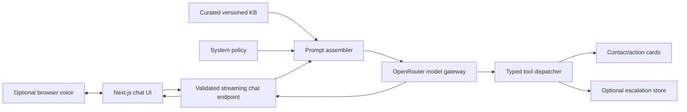

# Cadre Support Concierge Design

- Status: Historical — implementation handoff document, since executed.
  Where this draft says transcripts are session-only or excludes persistent
  history, it predates
  [ADR-008](../decisions/ADR-008-conversation-storage-with-private-mode.md)
  (conversation storage with notice, private mode, delete, enforced
  retention). `plan.md` and the ADRs are the current sources of truth.
- Date: 2026-07-08
- Product boundary: Public support concierge, not a client portal

## Product goal

Build a publicly deployed chatbot that accurately handles Cadre's common inbound
questions, provides verified next steps, and safely escalates questions it cannot
answer. The product should feel polished in text mode; voice is optional
progressive enhancement.

## Success criteria

1. All six scenarios in the take-home guide pass on the deployed URL.
2. Answers remain grounded in the curated Cadre knowledge base.
3. The bot never invents pricing, portal access, bookings, or security promises.
4. A user can reach a verified human-contact path from any unsupported question.
5. Architecture and scope decisions are visible in the repository.

## Approaches considered

### A. Curated support concierge - selected

One streaming chat model receives a compact system policy, curated knowledge, and
recent messages. A small typed tool allowlist controls actions. This is the best
fit for the brief because it is fast, explainable, inexpensive, and testable.

### B. Full-site RAG assistant

Chunk all 97 pages, embed them, retrieve sources, and answer from results. This
would support deeper article discovery but creates ranking, chunking, latency,
and evaluation work that does not improve the required scenarios.

### C. Authenticated portal assistant

Add login, persistent history, and client-specific records. This could become a
real Cadre product, but the take-home supplies no portal API, user model, or
account requirements. It would be mostly invented scope.

## System architecture

## Component responsibilities

- **UI:** input, transcript, source/action cards, voice controls, visible errors
- **API:** request validation, rate control, prompt assembly, streaming
- **Model gateway:** one provider interface and model configuration
- **Knowledge:** compact facts with explicit sources and boundaries
- **Tools:** allowlisted actions; no arbitrary network or database access
- **Escalation store:** consented minimal lead only, if approved
- **Verification:** scenario and boundary tests plus live deployment smoke checks

## Error handling

- Invalid or oversized message: reject before provider call.
- Rate limit exceeded: show a retry-later response without consuming model spend.
- Provider timeout/error: preserve typed input and offer retry/contact.
- Tool validation failure: request only the missing field.
- Escalation persistence failure: show direct Cadre contact details.
- Unsupported voice: hide/disable voice and preserve full text chat.
- Unknown answer: say what is unknown and offer a verified source or human path.

## Verification strategy

Convert `data/curated/scenario-coverage.md` into automated prompt/tool regression
tests. Test deterministic components with unit tests and the deployed experience
with browser tests. Include adversarial prompts for invented pricing, portal
password reset, guaranteed security, irrelevant questions, malformed contact
details, and prompt injection.

## Intentional cuts

- Authentication and client profiles
- Persistent transcript storage
- Full-site RAG and embeddings
- Real portal integration
- Unverified direct-calendar booking
- Realtime audio agent
- CRM integration and staff notification
- A large analytics dashboard

## Scaling path

Add retrieval when support content becomes too large or needs article-level
search. Add authentication only when client-specific sources are available.
Replace browser voice with a managed speech/realtime stack when voice is a
required channel. Connect the escalation tool to Cadre's real CRM only after its
schema, consent, and operational ownership are defined.
